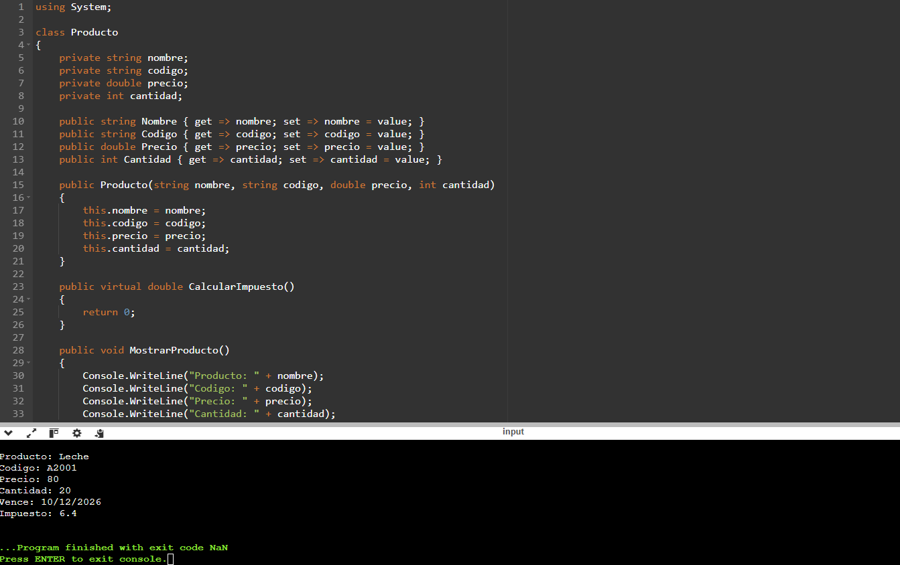
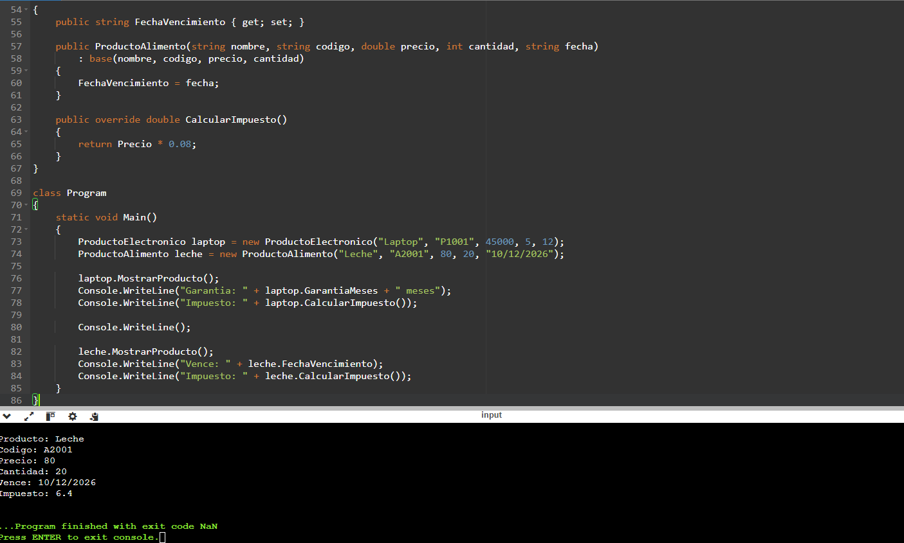
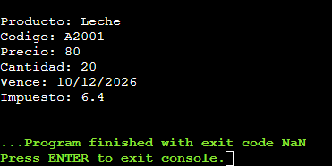

# Sistema de Gestión de Inventario en C#

## Descripción

Este programa permite gestionar productos electrónicos y alimentos utilizando programación orientada a objetos en C#.

Se aplican los siguientes conceptos:

* Encapsulación
* Herencia
* Polimorfismo

El sistema muestra la información de los productos y calcula automáticamente el impuesto según su tipo.

## Ejecución del programa

## _______________________________________________

- Universidad: Universidad Central del Este (UCE)
- Asignatura: Programación Básica
- Profesor: Gamalier Reyes
- Estudiante: Daikel Sabino
- Matrícula: 2022-4384
- Fecha: 13/03/26
